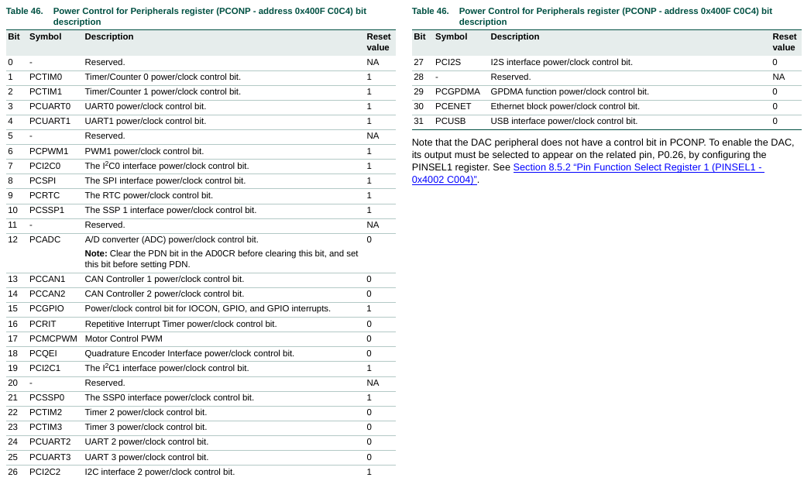
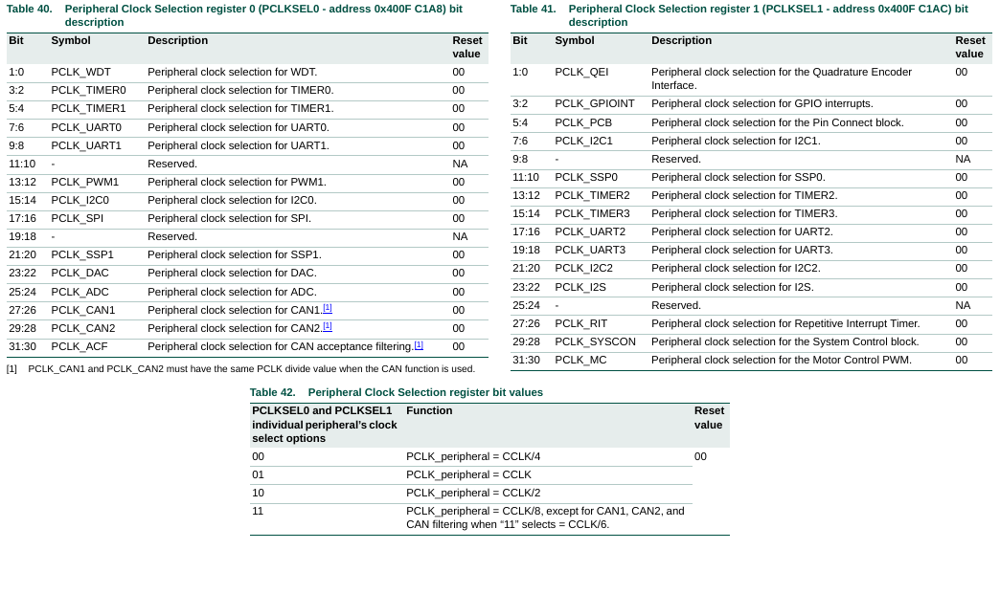
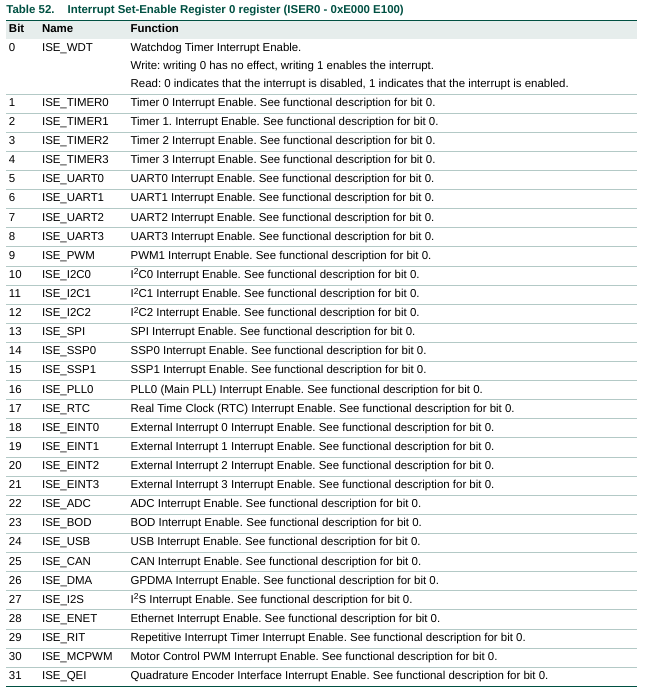
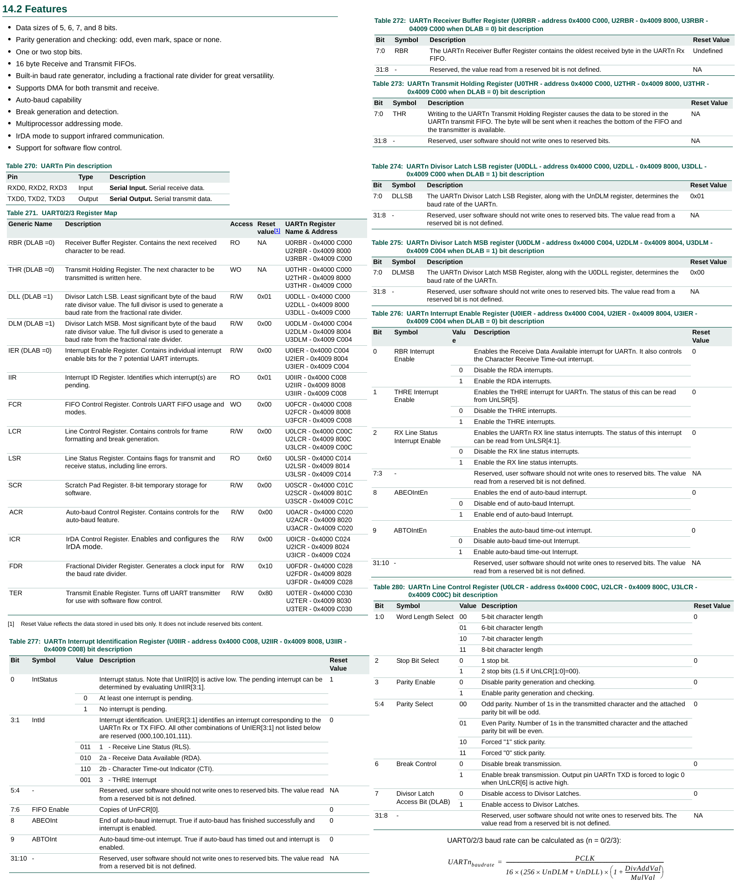
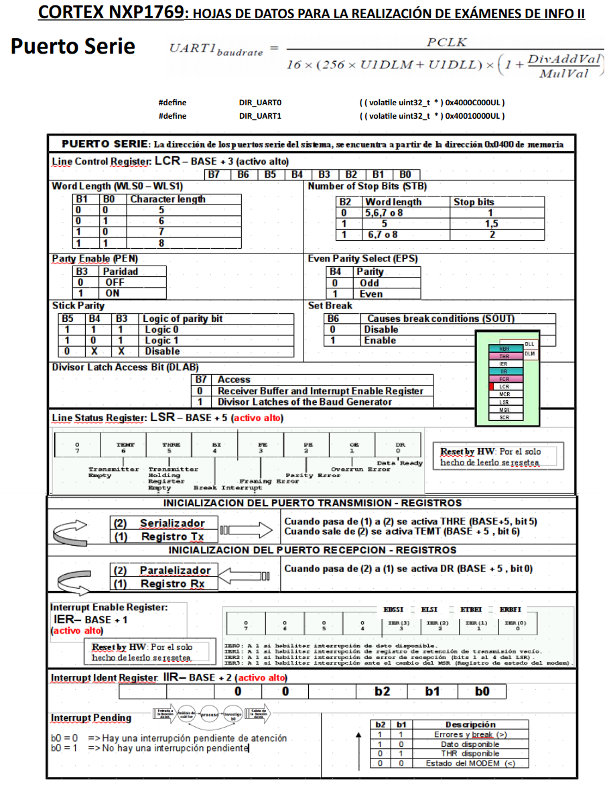
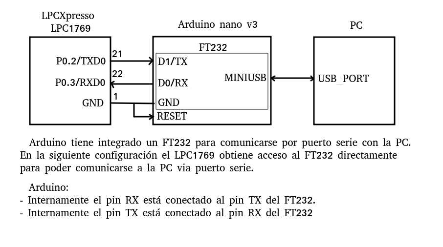
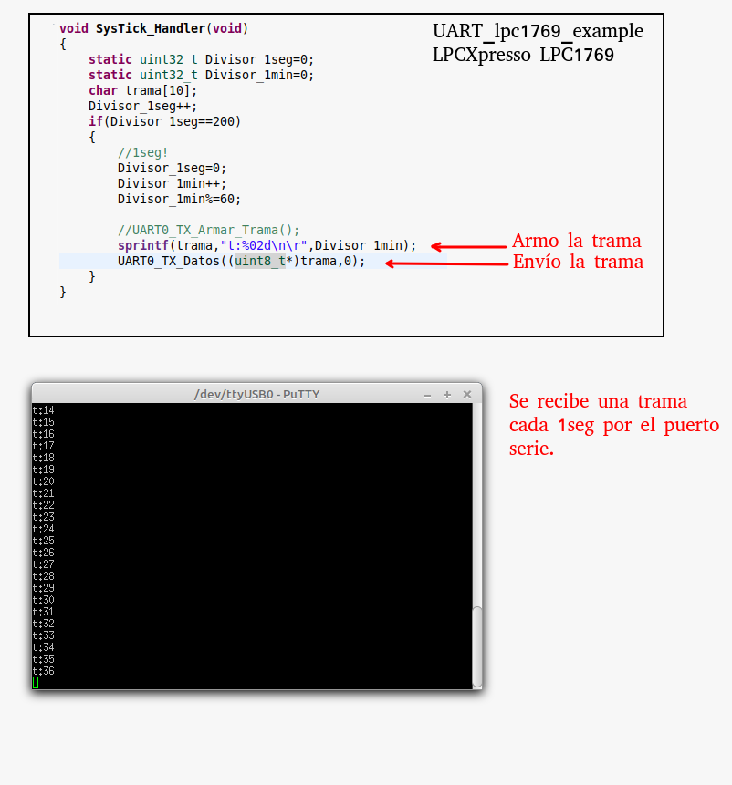

#   UART0 lpc1769 Ejemplo
Proyecto ejemplo para controlar la UART0 integrada en el micro controlador LPCXpresso lpc1769.
El ejemplo envía datos generados por el systick cada 1seg por UART0. 

- IDE: [MCUXpresso IDE](https://www.nxp.com/design/software/development-software/mcuxpresso-software-and-tools-/mcuxpresso-integrated-development-environment-ide:MCUXpresso-IDE).
- Lenguaje: C.
- Microcontrolador: [LPCXpresso lpc1769 rev C](https://www.embeddedartists.com/products/lpc1769-lpcxpresso/).
- UART0 1-N-8
- Systick 1000Hz 

---
## LPCXpresso LPC1769
 

---
### PCONP

---
### PCLKSELx

---
### ISER0

---
### UART0 - REGISTROS

---
### TESTING

---

Espero le sea de útilidad.

Aportes y sugerencias siempre serán bienvenidas.

Autor: @ealegremendoza

E-mail: ealegremendoza@gmail.com
